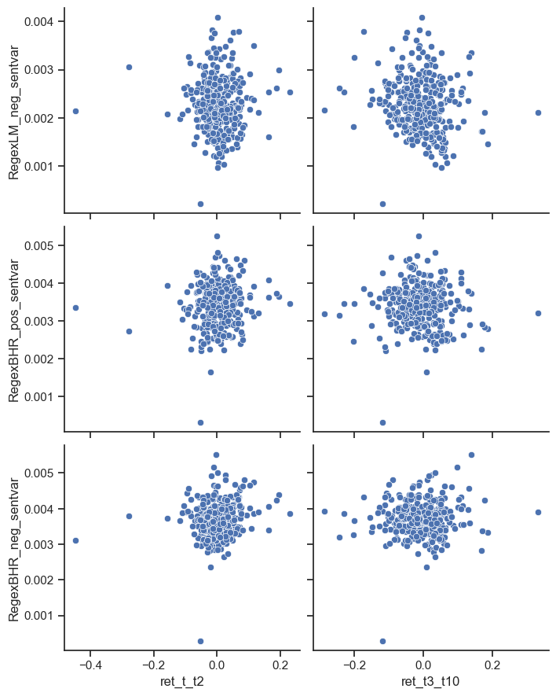

# 377 Midterm Report

### Summary:

In this project we asked the questions: Are stock returns released around the 10k date correlated to the sentiment of the text within the 10k?. To answer this question, I downloaded 500 of the most recent 10k folders from the sec website. The code is able to calculate 3 measurements of returns: returns on the 10k release date, rolling returns for two days out form the release date, and rolling returns for ten days out from the release date. I then calculated sentiment scores of four variables by calculating the positive and negative sentiment of the 10k based on two lists of positive and negative words (BHR and LM). I then compared those variables later in the report below:

### Data: 

**Sample**:
- The sample I used was SP500 dataset downloaded from a wikipedia page of all of the top 500 firms 

**Return variables**: 
- the return variables were built using the returns from the crsp dataset. The image below is the mapping of how all of the different pieces fit together for returns:


    
```python

pattern = r"\d{10}-\d{2}-\d{6}" 

accessionnumber = re.findall(pattern, file_string)

accession_number_set = set(accessionnumber) # this made them uniuque numbers 
accession_number_set # this is the set with only the unique accession numbers 

accession_list = list(accession_number_set)               #turned into a list 
 
CIK = [str(int(num.split('-')[0])) for num in accession_list]   # 
ciks_accnums = pd.DataFrame({'acc_number_unique': accession_list, 'cik': CIK})
ciks_accnums

```
- The above block of code searches for the correct accession numbers in the "pattern" variable and looks for them using .findall
    - I then turned it into a set to identify only the unique numbers (for some reason there were multiple instances of every firm with about two instances of each accession number) 
    - It then appends this accession number to a new dataframe "ciks_accnums" which is paired with its correct cik
    
- I was then able to merge this to the sp500 dataframe so the accession number is on the original dataset 

- Next, I was able to merge the crsp dataframe onto this new master SP500 dataframe to create a dataset that has the accession number, cik, firm, and returns on the 10k date 
    - The merge was done on the Ticker symbol and the 10k date to create a set of unique firms: 
    
```python 
    SP500Merge_With_Rets = SP500Merge.merge(crsp.rename(columns={'ticker':'Symbol', 'date':'filing_date'}),
                                         on=['Symbol', 'filing_date'],
                                         how='inner',
                                         validate='m:m')
```

**Sentiment Variables:** 

In my code, I included only the 4 sentiment vairiables from the ML and BHR word datasets (due to sleep and sanity). To do this I: 

- Defined the sentiments from the in class build sample: 
```python
BHR_negative = pd.read_csv('inputs/ML_negative_unigram.txt',
            names=['word'])['word'].to_list() 
```

- Defined variables in the regex format: 

```python
RegexLM_pos = ['('+"|".join(LM_positive)+')']
```
- And adjusted the in class "how to open a zip folder" code adjusted with my loop: 

```python
RegexLM_pos_sentvar = ( len(re.findall(NEAR_regex(RegexLM_pos, partial=False, max_words_between=5), cleaned))
                               / len(cleaned)
                              ) 
        SP500Merge_With_Rets.loc[index, 'RegexLM_pos_sentvar'] = RegexLM_pos_sentvar
``` 
**Caveat** 

- (Smell test): At the time I am writing this, the LM loop is only reading the words from the Negative side of the data so both LM positive and negative are the same, I tried to do the loop like the BHR lists which was not working


**Contextual Sentiment** 

While I was unable to correctly figure out how to define these variables and loop it all in with my code, I think that topics such as: Automation, Machine Learning, Medicine/Vaccine, Regulatory Policy, Changes in Supply/Demand, and Real Estate could all be cool topics to explore


### Results 


```python
import pandas as pd
import numpy as np
import matplotlib.pyplot as plt
import pandas_datareader as pdr
import seaborn as sns

# these three are used to open the CCM dataset:
from io import BytesIO
from zipfile import ZipFile
from urllib.request import urlopen
```


```python
analysis = pd.read_csv('output/analysis_sample.csv')
```


```python
columnret = ['ret_t_t2', 'ret_t3_t10']
columnsent = ['RegexLM_neg_sentvar', 'RegexBHR_pos_sentvar', 'RegexBHR_neg_sentvar']
df_subset = analysis[columnret + columnsent]

correlations = df_subset.corr()

correlationstable = correlations.stack().reset_index()
correlationstable.columns = ['Variable 1', 'Variable 2', 'Correlation']

returns_corr = correlations_table[(correlations_table['Variable 1'].isin(returns_cols)) & 
                                  (correlations_table['Variable 2'].isin(sentiment_cols))]
returns_corr

```


<div>
<style scoped>
    .dataframe tbody tr th:only-of-type {
        vertical-align: middle;
    }

    .dataframe tbody tr th {
        vertical-align: top;
    }

    .dataframe thead th {
        text-align: right;
    }
</style>
<table border="1" class="dataframe">
  <thead>
    <tr style="text-align: right;">
      <th></th>
      <th>Variable 1</th>
      <th>Variable 2</th>
      <th>Correlation</th>
    </tr>
  </thead>
  <tbody>
    <tr>
      <th>2</th>
      <td>ret_t_t2</td>
      <td>RegexLM_neg_sentvar</td>
      <td>0.009049</td>
    </tr>
    <tr>
      <th>3</th>
      <td>ret_t_t2</td>
      <td>RegexBHR_pos_sentvar</td>
      <td>0.092972</td>
    </tr>
    <tr>
      <th>4</th>
      <td>ret_t_t2</td>
      <td>RegexBHR_neg_sentvar</td>
      <td>0.132312</td>
    </tr>
    <tr>
      <th>7</th>
      <td>ret_t3_t10</td>
      <td>RegexLM_neg_sentvar</td>
      <td>-0.129333</td>
    </tr>
    <tr>
      <th>8</th>
      <td>ret_t3_t10</td>
      <td>RegexBHR_pos_sentvar</td>
      <td>-0.049074</td>
    </tr>
    <tr>
      <th>9</th>
      <td>ret_t3_t10</td>
      <td>RegexBHR_neg_sentvar</td>
      <td>0.059136</td>
    </tr>
  </tbody>
</table>
</div>


Correlation Scatterplot: 


```python
import seaborn as sns
import matplotlib.pyplot as plt
%matplotlib inline

returns_cols = ['ret_t_t2', 'ret_t3_t10']
sentiment_cols = ['RegexLM_neg_sentvar', 'RegexBHR_pos_sentvar', 'RegexBHR_neg_sentvar']

# Create a subset of the DataFrame with the relevant columns
df_subset = analysis[returns_cols + sentiment_cols]

# Create a grid of scatterplots for each sentiment variable against each return variable
sns.set(style='ticks')
sns.pairplot(df_subset, x_vars=returns_cols, y_vars=sentiment_cols, height=3, aspect=1.2, kind='scatter')
plt.show()

```


    

    


In the graphs above, we can see scatterplots of the correlation between returns and the sentiments from the 3 working word lists. Something interesting from these findings is that the graphs in the 3-10 day range reflect more of a correlated shape. For example, the LM negative 10 day graph shows a slightly negative correlation (which is what might be expected from how we framed out question in the first place). Also, the 2 day returns seem to have a tighter shape indicating a correlation close to zero. Most of these returns reflect a value close to zero which is not quite what we were looking for as far as results. Some explanations for this might include: error in the returns calculations or just the finding that sentiment does not reflect 2 and 10 day stock returns.  

Some promising similar results are found within the literature of this topic: In "When is a Liability not a Liability? Textual Analysis, Dictionaries, and 10-Ks" (The LM dataset), the researches found in their tests that when dividing firms into quintiles based on proportion of words, the 10ks produce "no discernable pattern". An interesting point they made was that there may have been bias due to high freequency words used both positive and negative, but how this may not widely affect the overall findings. This research was alot more robust and includes variables such as different sized companys, and each companies different financial metrics in the inputs. 

Looking to "The colour of finance words" (The BHR dataset) produced results based on both the 'bag of words' method and machine learning methods. They contest that machine learning methods outperform the bag of words as they can highlight which words might have more meaning, and words that are important but might be missed by humans. This can be extrapolated to the idea that *specific* words might have more weight than others to potentially correlate to, and predict future stock returns. 

In conclusion, my results match those of Loughran and Mcdonald that when using a basket of words dictionary, there is no discernable correlation between positive/negative sentiments in 10k filings and the firms subsequent stock returns.

